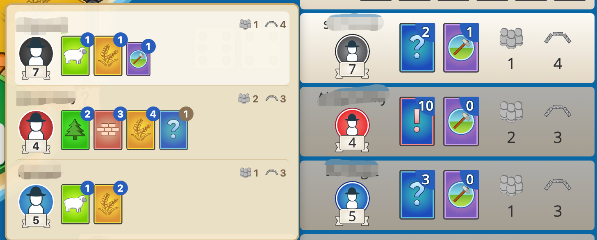

# Catan Counter

A Chrome extension that tracks opponents' resources in real-time during [Colonist.io](https://colonist.io/) games.

## Features

- **Multi-player support** — Tracks resources for all opponents in 3-4 player games
- **Real-time tracking** — Automatically detects resource gains, spending, trades, steals, and more from the game feed
- **Smart deduction** — Infers unknown cards when resource type is hidden (e.g. steals between other players), and resolves unknowns when players make trade offers
- **Game info overlay** — Shows player avatars, victory points, largest army, and longest road directly in the panel
- **Auto-correction** — Syncs tracked card totals with the game's displayed counts to minimize drift

### Tracked Events

| Event | Action |
|-------|--------|
| Dice roll collection | Add gained resources |
| Starting resources | Add initial hand |
| Build (road / settlement / city) | Subtract building cost |
| Buy development card | Subtract cost, increment dev card count |
| Use Knight / Road Building / Year of Plenty | Handle accordingly |
| Monopoly | Add resources to monopolizer, clear from all others |
| Steal (known type) | Transfer specific resource |
| Steal (unknown type) | Victim loses a card, stealer gains 1 unknown |
| Player trade | Update both players' resources |
| Maritime trade | Subtract 4:1 / 3:1 / 2:1 cost |
| Trade offer | Resolve unknowns — offered cards are confirmed known |

## Installation

1. Download or clone this repository
2. Open Chrome and navigate to `chrome://extensions/`
3. Enable **Developer mode** (top right)
4. Click **Load unpacked**
5. Select the project folder

## Usage

1. Join a game on [colonist.io](https://colonist.io/)
2. The tracking panel appears automatically on the left side, overlaying the built-in player info area
3. Press `` ` `` (backtick) to toggle the panel visibility

### Panel Layout

Each opponent section shows:

- Player avatar with colored background and glow effect
- Victory points badge
- Known resource cards with counts
- Unknown card backs with count (when resource type is uncertain)
- Development card count
- Largest army / longest road achievements (gold when meeting threshold)

## Controls

- **Backtick (`)** — Toggle panel visibility
- **Drag** — Click anywhere on the panel to reposition it
- **Reset** — Click the reset button to clear all tracking data and re-parse the game feed from scratch

## Technical Notes

- The extension is a single content script (`content.js`) injected into colonist.io pages
- It monitors the game's chat feed via `MutationObserver` to detect game events
- Player information (VP, army, road, active state) is scanned from the DOM every second
- The panel uses a `Shadow DOM` for style isolation from the host page
- Resource tracking uses a known/unknown model: specific resources are tracked when the game reveals them, otherwise cards are counted as "unknown" and displayed as card backs
